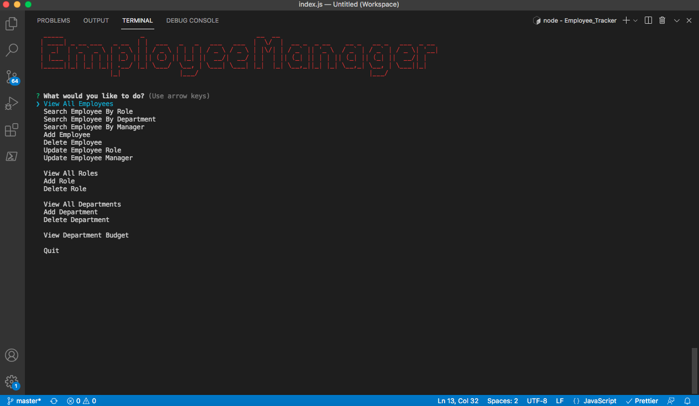

# Employee_Tracker

# Table of Contents

- [Description](#description)
- [Installation](#installation)
- [Usage](#usage)
- [Demo](*demo)
- [License](#license)

# Description

This application called Employee Tracker was created for managing employess, using Node.js and mysql, inquirer, console.table dependencies.

# Installation

Install nodejs and dependencies (npm inquirer) the download code

# Usage

Using nodejs, run node index.js to answer inputs to manage your employees

# Demo

# License

MIT
